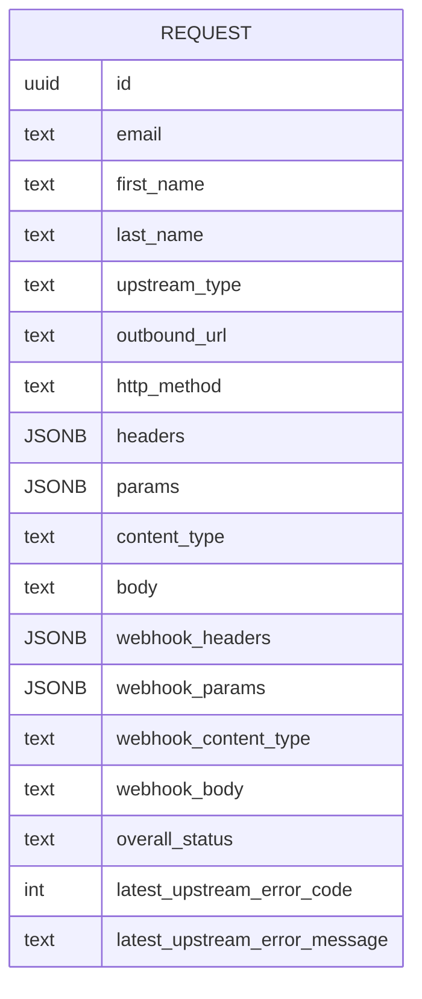

## Enum values
upstream_type: Siebel 
overall_status: Webhook received, Added to inbound queue, Webhook response initiatied, Webhook data retrieved, REST data recieved, Waiting in outbound queue, Trying upstream, Upstream success, Upstream error, Notify error, Notify success
