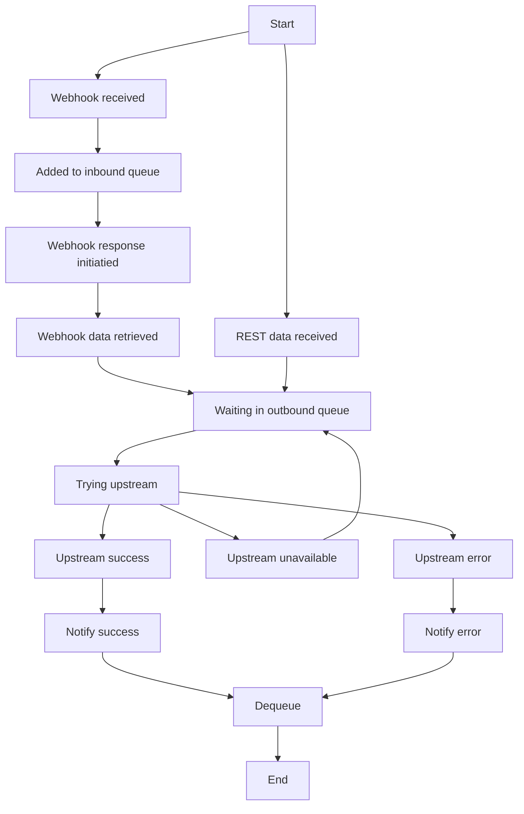

## State machine for overall logic
Each of these steps (with the exception of dequeue) are saved alongside submissions as a status. In the event of an unexpected crash, they can be resumed from their given state.
