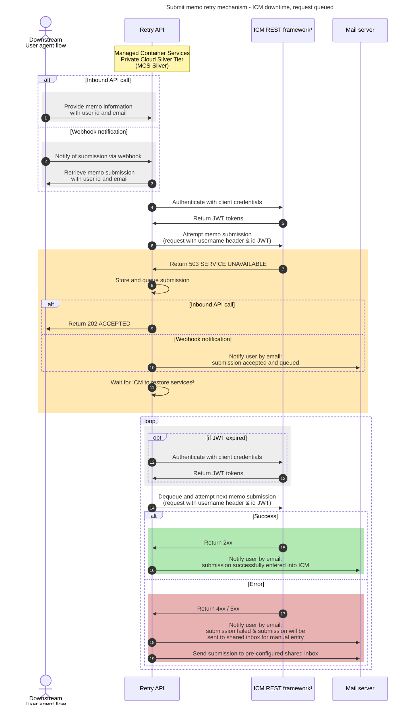

Additional information:

1. [ICM REST framework](https://dev.azure.com/bc-icm/SiebelCRM%20Lab/_wiki/wikis/SiebelCRM-Lab.wiki/575/Siebel-Application-Client-ID-(Service-Account)-Operation-for-DATA-API)

2. Logic TBD. Could be polling/retrying against 503, subscribing to another uptime service, some combination of the two, or something else entirely.
